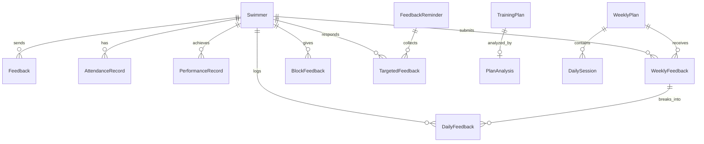

# AquaFlow Pro — Agent Blueprint (agents.md)

> **本文档定义了 AquaFlow Pro 的完整架构、设计语言和现实使用场景。**
> 任何 AI Agent 在接手任务前，必须先通读此文档 + [`request.md`](./requests/request.md)。
> 本文档描述"网站应该是什么样子"，`request.md` 描述"需要做什么 + 什么还没做"。

---

## 目录

1. [项目定位与现实场景](#1-项目定位与现实场景)
2. [用户角色与工作流](#2-用户角色与工作流)
3. [技术栈](#3-技术栈-tech-stack)
4. [设计系统](#4-设计系统-design-system)
5. [系统架构](#5-系统架构-architecture)
6. [路由与页面结构](#6-路由与页面结构)
7. [组件体系](#7-组件体系)
8. [数据模型](#8-数据模型-data-model)
9. [API 层](#9-api-层)
10. [状态同步引擎](#10-状态同步引擎)
11. [部署与运维](#11-部署与运维)
12. [开发规范](#12-开发规范)

---

## 1. 项目定位与现实场景

### 1.1 这是什么
AquaFlow Pro 是一套**专业游泳队训练管理系统**，服务对象是中国的一支青少年/业余竞技游泳队。

### 1.2 谁在用
- **教练**（1-2 人）：制定训练计划、管理出勤、查看队员反馈、追踪成绩
- **队员**（10-30 人）：查看训练安排、提交反馈、记录成绩、查看出勤
- 用户主要在**中国大陆**使用，需要**无 VPN 直连**

### 1.3 现实使用流程
```
周一教练发周计划 ──→ 队员每天查看训练 ──→ 训练后填反馈
   │                                              │
   │                                              ▼
   ├── 教练每天标出勤 ◄───────────── 教练查看反馈/状态
   │
   └── 周末教练查看周总结 ◄──── 队员提交周总结
```

### 1.4 核心价值
1. **教练不用再在微信群里口头传达训练计划**——直接发布，队员打开即看
2. **队员反馈不再丢失**——结构化记录每天的 RPE/酸痛/反思
3. **出勤数据化**——教练一键打卡，月度统计自动生成
4. **成绩追踪**——PB 自动标记，进步可视化

---

## 2. 用户角色与工作流

### 2.1 教练（Coach）
- **入口**：`/login?role=coach` → 验证后进入 `/dashboard`
- **布局**：桌面端有侧边栏 `Sidebar`，移动端有底部导航 `MobileNav`
- **权限**：可以增删改查所有数据，是系统的唯一管理员
- **核心日常**：
  1. 发布训练计划（日/周）
  2. 标记出勤
  3. 查看反馈
  4. 回复队员

### 2.2 队员（Athlete）
- **入口**：`/workout` → 登录页 `LoginForm` → 输入用户名密码 → 进到主界面
- **布局**：纯移动端优先，4 Tab 底部导航
- **权限**：只能看到自己的数据（反馈/成绩/出勤/针对自己的备注）
- **核心日常**：
  1. 查看今天训练内容
  2. 训练后填写当天反馈
  3. 周末提交周总结

### 2.3 会话模型
- 教练和队员使用同一个域名 `sw.sportsflow.best`
- 通过 `localStorage` key 区分身份：
  - `aquaflow_coach_session`：教练端
  - `aquaflow_athlete_id`：队员端（存储 swimmer.id）
- **重要约束**：同一浏览器不能同时维持教练 + 队员的 session（当前架构限制）

---

## 3. 技术栈 (Tech Stack)

### 3.1 前端

| 技术 | 版本 | 用途 |
|------|------|------|
| Next.js | 16.x | App Router、SSR/Edge Runtime |
| React | 19.x | UI 框架 |
| TypeScript | 5.x | 类型安全 |
| Tailwind CSS | 4.x | 样式系统 |
| tailwindcss-animate | 1.x | 动画 |
| Framer Motion | 11.x | 高级动画/过渡 |
| Lucide React | 0.563+ | 图标库 |
| canvas-confetti | 1.x | 成就庆祝动画 |

### 3.2 后端

| 技术 | 版本 | 用途 |
|------|------|------|
| Next.js API Routes | — | RESTful API（Edge Runtime） |
| Prisma ORM | 5.22 | 数据库 ORM + Migration |
| @prisma/adapter-neon | 5.22 | HTTP 适配器（Serverless） |
| @neondatabase/serverless | 0.10 | Neon PostgreSQL 驱动 |

### 3.3 基础设施

| 技术 | 用途 |
|------|------|
| Cloudflare Workers | 运行时（via OpenNext） |
| Cloudflare Pages | 静态资源托管 |
| Neon | Serverless PostgreSQL 数据库 |
| GitHub | 代码仓库 |
| Wrangler | Cloudflare 部署 CLI |

### 3.4 关键依赖链

```
用户浏览器
  └─ Next.js (App Router)
       ├─ 前端页面（React 19 + Tailwind 4）
       └─ API Routes (Edge Runtime)
            └─ Prisma ORM
                 └─ @prisma/adapter-neon（HTTP 连接）
                      └─ Neon PostgreSQL（Serverless）
```

---

## 4. 设计系统 (Design System)

### 4.1 设计理念
- **深海科技感**：全站深色底 + 青绿色主色调，营造专业、高端的运动科技感
- **玻璃拟态**：卡片使用 `backdrop-blur` + 半透明背景
- **移动端优先**：队员端按手机屏幕优化；教练端兼顾桌面和平板

### 4.2 调色板

| 变量 | HSL 值 | 十六进制近似 | 用途 |
|------|--------|-------------|------|
| `--background` | `hsl(222 47% 11%)` | `#0a192f` | 全站背景——深海蓝 |
| `--primary` | `hsl(168 100% 70%)` | `#64ffda` | 主色调——青绿色（所有按钮、高亮、Focus） |
| `--primary-foreground` | `hsl(222 47% 11%)` | `#0a192f` | 主色按钮上的文字（深色） |
| `--secondary` | `hsl(217 32% 17%)` | `#1e293b` | 次级面板背景 |
| `--muted-foreground` | `hsl(215 20% 65%)` | `#8892b0` | 次要文字、提示文字 |
| `--destructive` | `hsl(0 84% 60%)` | `#ef4444` | 危险操作（删除） |
| `--border` | `hsl(217 32% 17%)` | `#1e293b` | 卡片边框 |
| `--ring` | `hsl(168 100% 70%)` | `#64ffda` | Focus 环 |
| `--glass-bg` | `rgba(10, 25, 47, 0.7)` | — | 玻璃拟态背景 |
| `--glass-border` | `rgba(100, 255, 218, 0.1)` | — | 玻璃拟态边框 |

### 4.3 辅助色彩语义

| 颜色 | 用途 |
|------|------|
| 🟢 `green-400/500` | 已完成、已到场、成功 |
| 🟡 `yellow-400/500` | 警告、教练备注、草稿 |
| 🔴 `red-400/500` | 错误、需关注、删除、高 RPE |
| 🔵 `blue-400/500` | 信息、链接 |
| 🟣 `purple-400/500` | 交替泳姿、创意建议 |
| 🟠 `orange-400/500` | 专项反馈通知、教练提问 |

### 4.4 字体

```css
--font-sans: -apple-system, BlinkMacSystemFont, "Segoe UI",
             "Noto Sans SC", "PingFang SC", "Microsoft YaHei",
             "Helvetica Neue", Arial, sans-serif;
--font-mono: ui-monospace, "SF Mono", "Cascadia Code",
             "Roboto Mono", Menlo, Monaco, "Courier New", monospace;
```
- 中文优先加载苹方/微软雅黑/Noto Sans SC
- 等宽字体用于成绩、配速、时间等数据展示

### 4.5 圆角与间距
- `--radius`: `0.5rem` (8px)
- 卡片圆角：`rounded-2xl` (16px) 或 `rounded-3xl` (24px)
- 按钮圆角：`rounded-full` (药丸型) 或 `rounded-xl` (12px)
- 页面内边距：`p-4` (移动端) / `p-8` (桌面端)

### 4.6 动画规范
- 页面入场：`animate-in fade-in slide-in-from-bottom-4 duration-500`
- 卡片悬停：`hover:bg-card/60 transition-all`
- 按钮悬停：`hover:brightness-110` / `hover:scale-105`
- 加载状态：`animate-spin` (旋转) / `animate-pulse` (呼吸)
- 重要通知：`animate-bounce` (弹跳)

### 4.7 图标
- 全站使用 **Lucide React** 图标
- 常用图标：`Save`, `Trash2`, `Plus`, `ArrowLeft`, `Waves`, `Calendar`, `Activity`, `MessageSquare`, `TrendingUp`, `Send`, `Check`

---

## 5. 系统架构 (Architecture)

### 5.1 总体架构图

```
┌──────────────────────────────────────────────────────────────────┐
│                         用户浏览器                                │
│  ┌─────────────────┐              ┌─────────────────┐           │
│  │   教练端 (Coach) │              │   队员端 (Athlete)│           │
│  │   /dashboard/*  │              │   /workout       │           │
│  │   桌面+平板     │              │   移动端优先     │           │
│  └────────┬────────┘              └────────┬────────┘           │
│           │                                │                    │
│           └──────────┬─────────────────────┘                    │
│                      ▼                                          │
│           ┌─────────────────────┐                               │
│           │    useStore (Zustand-like)                           │
│           │    - 30s 轮询同步                                    │
│           │    - 15s Mutation Guard                              │
│           │    - Optimistic Updates                              │
│           └──────────┬──────────┘                               │
└──────────────────────┼──────────────────────────────────────────┘
                       │ fetch()
                       ▼
┌──────────────────────────────────┐
│   Cloudflare Workers (Edge)      │
│   Next.js API Routes             │
│   ┌────────────────────────────┐ │
│   │ withApiHandler (try/catch) │ │
│   │ getPrisma() (Lazy Singleton)│ │
│   │ flattenPayload (Normalizer)│ │
│   └────────────┬───────────────┘ │
└────────────────┼─────────────────┘
                 │ HTTP (neon adapter)
                 ▼
┌──────────────────────────────────┐
│   Neon Serverless PostgreSQL     │
│   (Prisma Schema - 12 Models)   │
└──────────────────────────────────┘
```

### 5.2 分层职责

| 层 | 职责 | 关键文件 |
|----|------|----------|
| **UI Layer** | 渲染页面、处理用户交互 | `app/`, `components/` |
| **State Layer** | 管理全局状态、同步逻辑 | `lib/store.tsx` |
| **API Client** | 封装 HTTP 请求 | `lib/api-client.ts` |
| **API Routes** | 处理请求、业务逻辑 | `app/api/*/route.ts` |
| **ORM Layer** | 数据库操作抽象 | `lib/prisma.ts`, `lib/db.ts` |
| **Database** | 持久化存储 | `prisma/schema.prisma` → Neon |
| **Infra** | 部署、CDN、域名 | `wrangler.toml`, Cloudflare |

---

## 6. 路由与页面结构

### 6.1 路由树

```
app/
├── page.tsx                    # 首页（入口选择：教练/队员）
├── layout.tsx                  # 根布局（StoreProvider + LanguageProvider + DbStatus）
│
├── (athlete)/                  # 队员端路由组
│   ├── login/page.tsx          # 队员登录页
│   └── workout/page.tsx        # 队员主仪表板（4 Tab）
│
├── (driver)/                   # 教练端路由组
│   ├── layout.tsx              # 教练布局（CoachGuard + Sidebar + MobileNav）
│   ├── dashboard/
│   │   ├── page.tsx            # 教练主仪表板
│   │   ├── new-plan/page.tsx   # 创建新日计划
│   │   ├── plan/[id]/page.tsx  # 编辑已有计划
│   │   ├── weekly-plan/page.tsx # 周计划管理
│   │   ├── attendance/page.tsx # 出勤管理
│   │   ├── athletes/page.tsx   # 队员管理
│   │   ├── feedbacks/page.tsx  # 反馈收件箱
│   │   ├── schedule/page.tsx   # 日历视图
│   │   └── quick-plan/page.tsx # 快速计划
│   └── settings/page.tsx       # 设置（清除数据等）
│
├── poolside/                   # 泳池边快捷模式（暂定）
│
└── api/                        # API 路由
    ├── swimmers/route.ts
    ├── plans/route.ts
    ├── weekly-plans/route.ts
    ├── attendance/route.ts
    ├── feedbacks/route.ts
    ├── weekly-feedbacks/route.ts
    ├── feedback-reminders/route.ts
    ├── performances/route.ts
    ├── keep-alive/route.ts
    └── diagnostic/route.ts
```

### 6.2 页面详情

#### 队员端 `/workout`（单页 4 Tab）

| Tab | 内容 |
|-----|------|
| 训练 | 本周训练日程 + 选中日的计划详情（训练块/图片/教练备注） |
| 反馈 | WeeklyFeedbackForm + TargetedFeedbackForm + CoachReplyPanel |
| 成绩 | PerformanceTracker + TrainingHistory |
| 状态 | Readiness 滑块 + 月度统计 + AttendanceCalendar |

#### 教练端 `/dashboard`（多页面 + 侧边栏）

| 页面 | 内容 |
|------|------|
| 主面板 | TodayAttendance + AthletesFeedbackPanel + SwimmerStatusPanel + TeamStatsPanel + 快捷导航 |
| 新计划 | PlanEditor（文本/照片双模式） |
| 周计划 | 创建周计划夹 + 上传每日 Session 照片 |
| 出勤 | 批量打卡 + 月度统计 |
| 队员 | 添加/编辑/删除队员 |
| 反馈 | TeamFeedbackSummary + 详细浏览/回复 |

---

## 7. 组件体系

### 7.1 组件目录结构

```
components/
├── DbStatus.tsx               # 数据库冷启动提示
├── athlete/                   # 队员端专用
│   ├── LoginForm.tsx          # 登录表单
│   ├── SwimmerSelect.tsx      # 队员选择器（已废弃，改用登录）
│   ├── AttendanceCalendar.tsx  # 月度出勤日历（只读）
│   ├── FeedbackForm.tsx       # 日反馈表单（RPE + 评论）
│   ├── WeeklyFeedbackForm.tsx # 周反馈表单（7天折叠 + 周总结）
│   ├── TargetedFeedbackForm.tsx # 教练专项提问回复
│   ├── CoachReplyPanel.tsx    # 教练批复展示
│   ├── BlockFeedbackPanel.tsx # 训练块级别反馈
│   ├── PerformanceTracker.tsx # 成绩添加/管理（~17KB）
│   ├── PerformanceChart.tsx   # 成绩图表
│   ├── TrainingHistory.tsx    # 训练历史浏览
│   └── ProfileUpdateModal.tsx # 个人信息更新弹窗
│
├── dashboard/                 # 教练端专用
│   ├── PlanEditor.tsx         # 核心计划编辑器（~60KB，最大组件）
│   ├── WorkoutLibrary.tsx     # 训练块模板库
│   ├── AIInsight.tsx          # AI 分析面板
│   ├── PlanCard.tsx           # 计划卡片（列表） 
│   ├── SwimmerModal.tsx       # 添加/编辑队员弹窗
│   ├── SwimmerStatusPanel.tsx # 队员状态监控
│   ├── TodayAttendance.tsx    # 今日出勤面板
│   ├── AttendanceStats.tsx    # 出勤统计
│   ├── AthletesFeedbackPanel.tsx # 反馈汇总+警报
│   ├── TeamFeedbackSummary.tsx   # 周总结提交情况
│   ├── TeamStatsPanel.tsx     # 团队统计（XP/等级）
│   ├── RecentPerformances.tsx # 最近成绩面板
│   ├── RefreshButton.tsx      # 手动刷新
│   └── PaceCalculator.tsx     # 配速计算器
│
├── auth/                      # 认证
│   └── CoachGuard.tsx         # 教练权限守卫
│
├── layout/                    # 布局
│   ├── Sidebar.tsx            # 教练端桌面侧边栏
│   └── MobileNav.tsx          # 教练端移动底部导航
│
├── plan/                      # 计划相关
│   └── PhotoUpload.tsx        # 图片上传组件（含压缩）
│
└── common/                    # 通用组件
    └── LanguageToggle.tsx     # 中英切换
```

### 7.2 关键组件说明

| 组件 | 复杂度 | 说明 |
|------|--------|------|
| **PlanEditor** | 🔴 极高（952 行） | 支持文本/照片双模式、训练块/项/分段三级编辑、分段动作、器材选择、包干/休息模式、个性化备注、模板保存/加载、AI 分析触发 |
| **WeeklyFeedbackForm** | 🟡 中高（307 行） | 7 天折叠式表单、RPE/酸痛滑块、反思输入、草稿保存、提交锁定、回滚容错 |
| **store.tsx** | 🔴 极高（484 行） | 全局状态管理、30s 轮询、15s Mutation Guard、所有 CRUD 操作 |

---

## 8. 数据模型 (Data Model)

### 8.1 ER 图概览



### 8.2 核心模型一览（12 个）

| 模型 | 核心字段 | 说明 |
|------|----------|------|
| `Swimmer` | name, group, username, password, xp, level, readiness | 队员身份 |
| `TrainingPlan` | date, group, blocks(JSON), totalDistance, targetedNotes(JSON), imageUrl | 日训练计划 |
| `WeeklyPlan` | weekStart, weekEnd, group, isPublished | 周训练夹 |
| `DailySession` | weeklyPlanId, label, date, imageData, notes | 周计划中的每日项 |
| `Feedback` | swimmerId, planId, rpe, soreness, comments | 单日反馈 |
| `WeeklyFeedback` | swimmerId, weekStart, summary, isSubmitted, coachReply | 周总结 |
| `DailyFeedback` | weeklyFeedbackId, date, rpe, soreness, reflection | 周总结中的每日子项 |
| `AttendanceRecord` | date, swimmerId, status, timestamp | 出勤记录 |
| `PerformanceRecord` | swimmerId, event, time, isPB, meetName | 成绩记录 |
| `BlockTemplate` | name, category, type, items(JSON) | 训练块模板 |
| `FeedbackReminder` | message, targetSwimmerIds(JSON), periodStart/End | 教练专项提问 |
| `TargetedFeedback` | reminderId, swimmerId, content, coachReply | 专项提问回复 |
| `PlanAnalysis` | planId, imageUrl, rawText, structuredData, aiSuggestions | AI 计划分析 |

### 8.3 关键复合唯一约束

| 约束 | 意义 |
|------|------|
| `WeeklyFeedback(swimmerId, weekStart)` | 每人每周只能有一份周总结 |
| `DailyFeedback(swimmerId, date)` | 每人每天只有一条日反馈 |
| `BlockFeedback(planId, blockId, swimmerId)` | 每人对每个训练块只能反馈一次 |
| `TargetedFeedback(reminderId, swimmerId)` | 每人对每个提问只能回复一次 |
| `Swimmer.username` | 用户名唯一 |

---

## 9. API 层

### 9.1 路由总览

| 路由 | 方法 | 用途 |
|------|------|------|
| `/api/swimmers` | GET / POST / PUT / DELETE | 队员 CRUD |
| `/api/plans` | GET / POST / PUT / DELETE | 日训练计划 CRUD |
| `/api/weekly-plans` | GET / POST / PUT / DELETE | 周计划 CRUD |
| `/api/attendance` | GET / POST / DELETE | 出勤打卡 |
| `/api/feedbacks` | GET / POST | 日反馈 |
| `/api/weekly-feedbacks` | GET / POST / PATCH | 周总结（含教练回复） |
| `/api/feedback-reminders` | GET / POST / PATCH | 专项反馈（含回复） |
| `/api/performances` | GET / POST / PUT / DELETE | 成绩 CRUD |
| `/api/keep-alive` | GET | 数据库保活 |
| `/api/diagnostic` | GET | 运行时诊断 |

### 9.2 API 设计规范

1. **所有路由**必须包裹 `withApiHandler`（异常捕获，返回 JSON 而非 Worker 崩溃）
2. **所有响应**必须携带 `V12_FINGERPRINT` headers
3. **所有 POST 请求体**必须经过 `flattenPayload` 处理（防数据嵌套 Bug）
4. **所有 GET 列表响应**返回裸数组 `[]`，不包裹 `{ data: [...] }`
5. **Prisma 实例**通过 `getPrisma()` 获取（懒加载，非顶层初始化）

---

## 10. 状态同步引擎

### 10.1 架构

```
lib/store.tsx (React Context + useReducer 模式)
│
├── 初始化 ──→ 并行 fetch 所有 API
│              ├── /api/swimmers
│              ├── /api/plans
│              ├── /api/attendance
│              ├── /api/feedbacks
│              ├── /api/performances
│              ├── /api/weekly-plans
│              └── /api/weekly-feedbacks
│
├── 30s 轮询 ──→ 自动重新 fetch（背景静默）
│                  └── 被 Mutation Guard 阻止？→ 跳过本次
│
├── 用户操作 ──→ 乐观更新本地 → 异步 POST/PUT → recordMutation()
│
└── recordMutation() ──→ 设 15s 锁 → 期间忽略服务端 pull
```

### 10.2 关键要点
- **同步不是实时的**——最坏情况下有 30 秒延迟
- **乐观更新确保 UI 即时响应**——用户看到的变化是立即的
- **Mutation Guard 防止数据覆盖**——用户改完后 15 秒内不会被旧数据冲掉

---

## 11. 部署与运维

### 11.1 部署流程

```bash
# 1. 清理
rm -rf node_modules .next .open-next

# 2. 安装
npm install

# 3. 生成 Prisma Client
npx prisma generate

# 4. 构建 + 部署
npm run deploy
# (等价于: opennextjs-cloudflare build && wrangler deploy)
```

### 11.2 环境变量

| 变量 | 说明 | 存放位置 |
|------|------|----------|
| `DATABASE_URL` | Neon PostgreSQL 连接字符串 | Cloudflare Dashboard → Settings → Variables |

### 11.3 域名

| 域名 | 说明 |
|------|------|
| `sw.sportsflow.best` | 正式域名（中国大陆免 VPN） |
| `aquaflow-pro.pages.dev` | Cloudflare 默认域名（备用） |

### 11.4 Wrangler 配置

```toml
name = "aquaflow-pro"
main = ".open-next/worker.js"
compatibility_date = "2024-11-18"
compatibility_flags = ["nodejs_compat"]

[build]
command = "npx opennextjs-cloudflare build"

[assets]
directory = ".open-next/assets"
binding = "ASSETS"
```

---

## 12. 开发规范

### 12.1 文件命名
- 组件文件：`PascalCase.tsx`
- 工具文件：`kebab-case.ts`
- API 路由：`route.ts`（Next.js 约定）
- 页面：`page.tsx`（Next.js 约定）

### 12.2 状态管理原则
1. **全局状态**全部通过 `useStore()` 访问
2. **局部 UI 状态**使用组件内 `useState`
3. **绝不**直接 fetch API——通过 `useStore()` 的方法或 `lib/api-client.ts`

### 12.3 样式规范
1. 使用 Tailwind 工具类，**不写**自定义 CSS（除 `globals.css` 中的 CSS 变量）
2. 颜色使用 CSS 变量（`bg-primary`, `text-muted-foreground`），**不硬编码** hex 值
3. 间距使用 Tailwind 标准档位（`p-4`, `gap-3`, `mb-6`）
4. 暗色模式是**默认且唯一**模式（不需要 `dark:` 前缀）

### 12.4 构建安全
- `next.config.ts` 中 `typescript.ignoreBuildErrors = true`——这是临时措施
- 部署前应跑一次 `npx tsc --noEmit` 确认无类型报错（目前尚未做到）

### 12.5 文档维护
- **每次完成任务后**必须更新 `docs/requests/request.md` 中对应条目状态
- **每次架构变动后**应考虑更新本文档 `docs/agents.md`
- **新需求**追加到 `request.md` 对应章节
- **错误修复**记录到 `request.md` 第 6/7 章

---

*此文档由 Antigravity 于 2026-04-18 基于全量代码分析生成。*
*最后更新：2026-04-18 21:16 CST*
