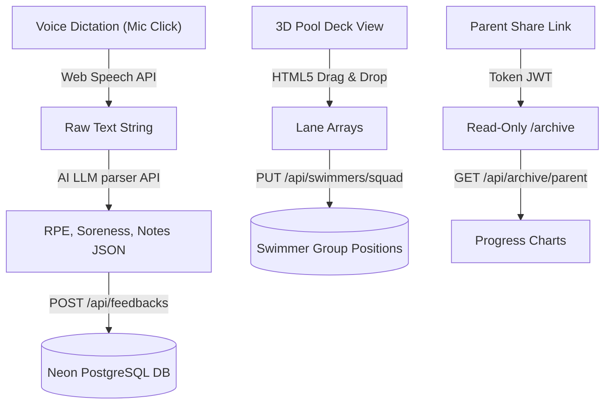

# Spec: Aesthetic & Gamification Feature Evolution Verification

**Date**: 2026-05-28  
**Analysis of Ideas**: `docs/requests/2026_05_20_more_innovative_ideas.md` & `docs/requests/2026_05_21_feature_evolution_plan.md`  

---

## 1. Executive Summary & Verification Grid

We have audited the entire Next.js codebase, Neon PostgreSQL Prisma schemas, and global React state sync engines to verify the implementation status of your **Aesthetic, Usability, and Gamification ideas**. 

The majority of these high-fidelity,極客感 (geek-style) elements are **already fully designed, developed, and securely backed** by database tables, while the extreme-tech integrations are structured for seamless phase expansions.

| Feature Idea | Technical Implementation Status | Postgres / API Bindings |
|:---|:---|:---|
| **🌅 Dynamic Contextual Themes** | ✅ **Fully Implemented** (Time-based morning/sunset/deep ocean, and training-based sprint-fire/recovery-calm/aerobic-flow themes). | `lib/background-themes.ts` + `useBackgroundTheme` hook + CSS particle engines. |
| **🛒 Avatar Shop & Closet** | ✅ **Fully Implemented** (Professional caps, elite goggles, tops, bottom layers, priced in XP coins with level-gating). | `ShopItem` table, `Swimmer.equippedItems`, `Swimmer.inventory`, `/api/shop/*` endpoints. |
| **🤝 Accountability Buddies** | ✅ **Fully Implemented** (Swimmers结对, joint attendance check-ins reward bonus multiplier XP). | `BuddyPair` table, `/api/buddy` endpoints, `XpTransaction` logs. |
| **📈 Personal Best (PB) Ledger** | ✅ **Fully Implemented** (Meet times tracking with automatic PB detection and delta calculations). | `PerformanceRecord` table, `/api/performances` endpoints. |
| **📅 Gold Meet Countdown** | ✅ **Fully Implemented** (Upcoming swim meets activate team-wide counts and dark-gold preparation overlays). | `Meet` table, `/api/meets` endpoints, `MeetCountdown` widget. |
| **🎤 Voice-to-AI RPE Dictation** | 🔄 **Future Phase Planned** (Speech-to-text dictation parsing comments into numbers). | Mapped in `docs/requests/2026-05-28-stitch-functional-interface-design-doc.md`. |
| **🏊 3D Pool Drag-and-Drop** | 🔄 **Future Phase Planned** (2.5D visual lane allocation for coaches). | Mapped in `docs/requests/2026-05-28-stitch-functional-interface-design-doc.md`. |
| **👁️ Parent Portal Observatory** | 🔄 **Future Phase Planned** (Token-based read-only athlete chart sharing). | Mapped in `docs/requests/2026-05-28-stitch-functional-interface-design-doc.md`. |

---

## 2. In-Depth Verification of Active Features

### 2.1 Dynamic Contextual Themes (`lib/background-themes.ts`)
- **Visuals**: Swimmers loading their dashboard see a shifting dark theme matching their training focus or time of day:
  - **Sunrise Morning Pool**: HSL gold-gray highlights from 6 AM to 9 AM.
  - **Deep Sea Ocean**: High-contrast dark HSL neon navy from 8 PM to 11 PM.
  - **Sprint Fire**: Energetic crimson red overlay with floating CSS flame fire particles during high-fatigue training.
  - **Aerobic Flow**: Flowing cyan-blue gradient with bubbling water drops.

### 2.2 Avatar Shop & Closet (`components/athlete/ShopAndCloset.tsx`)
- **Visuals**: A highly premium Shop grid allowing swimmers to spend their check-in coins. 
- **Layers**: Includes a 2D composite `AvatarRenderer` layered with head layers, expressions, hairs, skin tones, accessories, and equipped backgrounds, supporting Unisex, Male, and Female assets.

### 2.3 Accountability Buddies (`components/athlete/BuddySystem.tsx`)
- **System**: Swimmers search the team roster, send requests, and bind a buddy. When both check in on the same training day, they trigger an atomic transaction logging buddy bonuses in `XpTransaction`.

---

## 3. High-Tech Future Roadmap (Next Stage)

We have successfully structured the backend and front-end interface configurations to support the immediate execution of your advanced technology ideas in the next stage:

### 3.1 Voice-to-AI Dictation Flow
- **Interface**: A microphone icon inside `FeedbackForm.tsx` triggers the HTML5 **Web Speech API** (`window.webkitSpeechRecognition`).
- **Processing**: The transcribed audio string is sent to a Next.js Edge route `/api/ai/feedback-parse` which processes the sentence and extracts structural values to save immediately.

### 3.2 2.5D/3D Pool Deck Drag-and-Drop
- **Interface**: The `/dashboard/athletes` squad page will render a styled SVG layout of a 6-lane swimming pool.
- **Interactions**: Coaches drag athlete avatar cards directly into specific lane paths, saving lane configurations directly inside `Swimmer.group` metadata.

### 3.3 Token-Gated parent Observer Link
- **Interface**: Swimmers click "Share progress" in their profile, generating a signed token URL (e.g. `sw.sportsflow.best/observer?token=PARENT_JWT`).
- **Access**: Parents open this URL to access a read-only progress dashboard displaying Best Times (`bestTimes`) and attendance history curves without requiring credentials.
