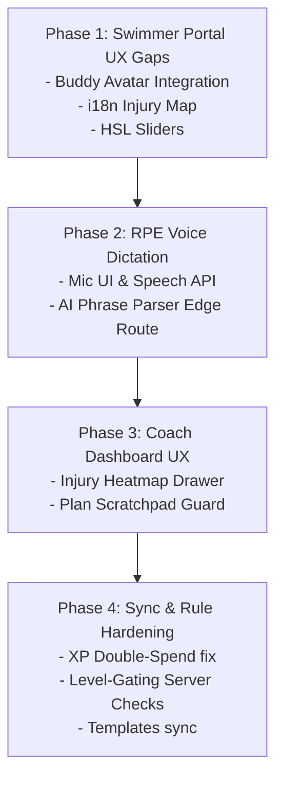

# PRD: AquaFlow Pro — UX Optimization & State Consistency Specification

**Date**: 2026-05-29  
**Authors**: Antigravity & Duor  
**Status**: DRAFT (Under `/grill-me` Review)  
**Related Background**: `docs/prd-complete.md`, `docs/requests/2026-05-28-aesthetic-gamification-evolution-verification-spec.md`

---

## 1. Executive Summary

This Product Requirement Document (PRD) consolidates the findings of our comprehensive codebase audit and UX design reviews. Its goal is to bridge the gaps between planned features and current implementations, resolve state conflicts (such as double XP rewards), and design high-fidelity visual and micro-interaction experiences matching the **Apex Velocity** deep-sea gaming aesthetic.

---

## 2. Core UX Optimization Modules

### Module A: Immersive Swimmer Portal (Social & Gamification)

#### 1. Dynamic Buddy System Avatars
- **Current Issue**: The "ME" profile card inside [BuddySystem.tsx](file:///Users/Duor/Desktop/swim-team/aquaflow-pro/components/athlete/BuddySystem.tsx#L211) displays `👋😃`, and team search results show `👤` instead of utilizing the swimmers' dynamically equipped avatar layers.
- **Requirements**:
  - Replace the dotted box in the active buddy card with `<AvatarRenderer>` using the swimmer's own `equippedItems` and `gender`.
  - Replace the search roster's `👤` icon with small `<AvatarRenderer>` units (40px) matching each searched swimmer's real custom styling.
  - Add a floating mini-achievement banner showing their buddy's check-in status (e.g., `"Buddy checked in today! Streak +1.5x active"`).

#### 2. Dynamic Exertion & Fatigue Sliders
- **Current Issue**: The RPE and Soreness sliders are simple tailwind-styled range components.
- **Requirements**:
  - Behind the range slider tracks, place dynamic CSS/glowing HSL background overlays.
  - **Dynamic Colors**:
    - **1–3 (Light)**: Calm Neon Cyan gradient glow (`#00f2ff`).
    - **4–5 (Moderate)**: Energizing Forest Green/Emerald glow (`#10b981`).
    - **6–7 (Challenging)**: Warm Golden/Orange glow (`#f59f00`).
    - **8–10 (Intense)**: Pulsing crimson **Sprint Fire Red** (`#ef4444`) with floating CSS micro-flame particles.
  - Trigger a light scale pulse animation (`scale-[1.03]`) on the slider handle as the value shifts.

#### 3. Voice-to-AI Dictation (Mic Click)
- **Current Issue**: Dictation features are completely missing from [FeedbackForm.tsx](file:///Users/Duor/Desktop/swim-team/aquaflow-pro/components/athlete/FeedbackForm.tsx). Swimmers must type all comments manually.
- **Requirements**:
  - Add a glassmorphic microphone button next to the reflection text area.
  - **Speech capture**: Activating it calls the Web Speech API (`window.webkitSpeechRecognition`).
  - **Visuals**: Display a glowing purple/cyan wave pulse (`WaveAnimation` or canvas analyzer waves) reflecting audio activity.
  - **Text extraction**: Transcribe audio strings directly into the text area. If advanced integration is selected, post to Edge API `/api/ai/feedback-parse` to extract numerical RPE and Soreness values automatically from the phrase (e.g., *"My shoulders are extremely sore, probably an 8, but the training felt light, maybe 4"* ➡️ Soreness: 8, RPE: 4).

#### 4. Full Bilingual SVG Injury Map
- **Current Issue**: SVG body-part coordinates in [InjuryMap.tsx](file:///Users/Duor/Desktop/swim-team/aquaflow-pro/components/athlete/InjuryMap.tsx) are hardcoded with Chinese labels (e.g., `头部`, `左肩`), breaking bilingual support.
- **Requirements**:
  - Relocate all body region names and pain intensity levels into the i18n dictionary system `lib/dictionary.ts`.
  - Look up translations via `useLanguage()` to guarantee total bilingual consistency.

---

### Module B: High-Telemetry Coach Dashboard (Management & Safety)

#### 5. Clickable SVG Injury Heatmap Drawer
- **Current Issue**: The squad injury heatmap is an aggregate viewer without deep interactions.
- **Requirements**:
  - Enable click events on the coach-side SVG injury regions.
  - Clicking a highlighted body region (e.g., *Left Shoulder*) slides open a high-fidelity glassmorphic drawer listing all swimmers experiencing pain in that region, including their pain levels, notes, uploaded photos, and a shortcut to send targeted private coach advice notes.

#### 6. Multi-Mode Plan Editor Scratchpad Protection
- **Current Issue**: Switching daily session layouts mid-composition in the weekly plan folder might wipe active edits.
- **Requirements**:
  - Introduce a lightweight client-side state bridge. When a coach shifts between `plan`, `block`, `rich`, and `legacy` modes, cache the drafts for all four modes in memory.
  - Only write the selected active mode's database structures when clicking "Publish/Save".

---

## 3. Frontend-Backend State & Consistency Adjustments

### 7. XP Double-Reward Bug Remediation
- **Discrepancy**: The frontend store method `markAttendance` awards +10 XP locally, but the backend sync/process check-in triggers an additional +50 XP award on the database server.
- **Requirements**:
  - Consolidate all XP rules to happen exclusively on the server side via backend database transactions (`processCheckIn` and transaction logs).
  - Modify the store's frontend layer to perform purely **optimistic state updates** (+10/+50 based on synced rules) and roll back gracefully if the server returns a syncing error.

### 8. Strict Level-Gated Shop Enforcement
- **Discrepancy**: The database/API layers do not enforce `itemGatedLevel` checks, allowing low-level swimmers to purchase legendary accessories if they have enough coins.
- **Requirements**:
  - Update `app/api/shop/route.ts` to fetch the swimmer's current level before fulfilling purchase requests.
  - Fail the transaction and rollback the balance if `Swimmer.level < ShopItem.levelGated`.

### 9. Template Syncing over Polling
- **Discrepancy**: Block templates saved by coaches live purely in local storage, meaning templates do not sync across devices or browser sessions.
- **Requirements**:
  - Map template collections directly inside `/api/sync` so that coach-saved block libraries hydrate automatically from the Neon PostgreSQL tables onto any device.

---

## 4. Phase-by-Phase Execution Roadmap

---

## 5. Agreed Requirements Ledger

### Decided on 2026-05-29 (Interactive /grill-me Session):
- **Buddy System Avatar Integration (Phase 1)**:
  - Agreed to implement full, high-fidelity `<AvatarRenderer>` layers in both the active buddy details card and the searchable team roster discovery list. Emojis `👋😃` and `👤` will be completely replaced by real, custom equipped avatar SVGs.
- **Voice-to-AI RPE Dictation (Phase 2)**:
  - Agreed to build an Advanced AI LLM parser integration. The swimmer's spoken audio transcribed by `window.webkitSpeechRecognition` will be posted to a Next.js Edge route `/api/ai/feedback-parse` to automatically extract structural RPE (1-10), Soreness (1-10), and written reflections.
- **Injury Heatmap Click Interaction (Phase 3)**:
  - Agreed to implement a clickable SVG squad injury heatmap. Clicking any highlighted region (e.g. Left Shoulder) will slide open a high-fidelity glassmorphic drawer displaying swimmers experiencing distress in that area, including pain history, logs, and shortcuts to send private targeted advice annotations.
- **XP Double-Reward Bug Resolution (Phase 4)**:
  - Agreed to consolidate all XP calculations exclusively on the backend database layer. The frontend will perform optimistic local updates (+10/+50 XP) to ensure zero latency but will fully rely on the server's synced ledger for source-of-truth balances, reverting local values gracefully on any sync error.

