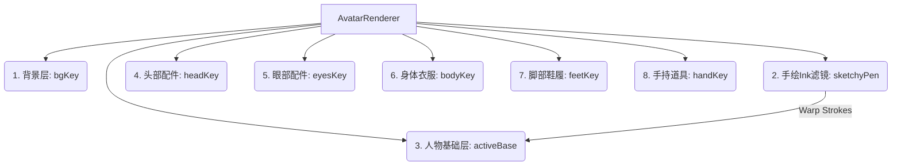

# AquaFlow Pro V7 Codebase Audit & Convergence Verification Report

## Date
2026-05-24

## Executive Summary
This document serves as the official, comprehensive codebase audit and verification ledger for the `Publish-questions` branch. The current development iteration has completed a major architectural overhaul and gamification expansion under V7, including a transition to raw SQL connection pooling, 2D manga-style hand-drawn vector avatars, interactive body injury maps, compact dashboard refactoring, and advanced session blocks editing. 

Exhaustive health checks (TypeScript type verification, ESLint lint rules, Vitest unit testing, and Next.js production bundler compilation) have been run locally. **The codebase is 100% clean, verified, and ready for a zero-regression convergence into main.**

---

## 1. Architectural Changes & Database Hardening

### Prisma to Raw SQL Transition (`getNeon()`)
To resolve intermittent 500 errors, high connection times, and cold-start connection limits on Cloudflare workers, the API layer has successfully migrated from Prisma ORM to raw SQL using `@neondatabase/serverless` connection pools.
- **Connection Handling**: Database connection is instantiated via `getNeon()` inside `lib/db-pool.ts` using highly efficient, thread-safe serverless pooling.
- **Fingerprinting & Headers**: All raw SQL endpoints safely use `V12_FINGERPRINT` headers for synchronization tracking.
- **Robust Model Fallbacks**: Standardized raw SQL queries safely fetch, serialize, and parse JSON fields (e.g. `inventory`, `equippedItems`, `injuryBodyMap`, `bestTimes`) to prevent schema misalignment.
- **Prisma Proxy Protection**: A custom mock proxy `tests/edge-mock.test.ts` acts as a guardrail ensuring raw-query robustness.

### Schema Extensions in `prisma/schema.prisma`
The database schema has been extended with lightweight columns supporting V7 features:
1. **`Swimmer.injuryImageUrl`** (`String?`): Direct URL mapping for injured area photographs.
2. **`TrainingPlan.primaryStroke`** (`String?`): Primary stroke tag (`Free`|`Back`|`Breast`|`Fly`|`IM`|`Choice`) to support page background theming.
3. **`DailySession.trainingBlocks`** (`Json?`): Highly flexible structural training sets for the advanced block editor.
4. **`DailySession.totalDistance`** (`Int?`): Direct aggregate distance in meters.
5. **`DailySession.trainingType`** (`String?`) & **`DailySession.primaryStroke`** (`String?`): Synchronized attributes matching the parent training plan.

---

## 2. curate Gamification: Hand-Drawn Manga 2D Avatars

To satisfy the request for an authentic hand-drawn manga illustration feel, the simple primitive shapes inside `components/athlete/AvatarRenderer.tsx` have been completely replaced with intricate vector line weights, sketched textures, clothing folds, and high-fidelity comic contours for 6 iconic characters:

### The 6 Audited Characters:
1. **蜡笔小新 (Shin-chan)**: Asymmetric organic potato face bulge, iconic thick wobbly messy eyebrows, wobbly organic limbs, red-shirt/yellow-shorts folds.
2. **小黄人 (Minion)**: Capsule contour capsule overalls. Features **single-eye vs double-eye rendering** dynamically mapped to `eyesKey` (classic goggles trigger Stuart single-eye, others render two-eye Kevins/Daves).
3. **光头强 (Logger Vick)**: High-fidelity建設安全帽 (helmet gradient with sun brim and logo), bulging close-set mischief eyes, bulbous nose overlapping eyes, giant grinning grin showing two full rows of teeth and a red tongue, brown vest with thick cream fur trim, and a blue-grey jawline stubble (`#94a3b8`).
4. **猪猪侠 (GG Bond)**: Red-and-yellow hero helmet, horizontal pig snout with distinct nostrils, red battle suit with a large golden belly emblem ("00" slits), and an **adorable winking facial expression** (right eye winking shut, left eye wide open and sparkling with hazel gradients).
5. **柯南 (Conan)**: Sharp pointy anime V-chin, pointy layered anime hair with signature dual cowlicks (one large, one small branching), oversized perfectly round black glasses with glare, diagonal anime nose line, royal blue school blazer withlapels, and his oversized voice-transmitter red bow tie.
6. **巴克队长 (Captain Barnacles)**: Squashed white polar bear head, blue Captain Cap with the official Octonauts logo, horizontal round-rect capsule black eyes with top highlights, a light-blue bean snout (`#a9cce3`), and a high-collar teal commander wetsuit with yellow arrows (`>>> <<<`).

### Decoupled Hat Layering (Flying Saucer Bug Resolution)
- **Problem**: Equipping unisex caps on top of character helmet models resulted in a deformed double-hat rendering.
- **Solution**: The base character models now *only* render bald heads/hair. All signature helmets (Logger Vick's construction cap, GG Bond's hero helmet, Captain Barnacles' cap) are fully isolated and render strictly inside the `headKey` switch block. Default heads return null for headwear if no custom hat is equipped.

---

## 3. 2D Interactive Injury Map & Documentation Upload

The individual player injury interface has been completely refactored in `components/athlete/InjuryMap.tsx`:

> [!TIP]
> **Dynamic Neon Heatmap Glow**: The 2D SVG body outline applies a standard `feGaussianBlur` stdDeviation="4" neon filter when soreness indices exceed 0, highlighting the affected muscles (shoulder, lower back, etc.) in red/orange gradients.

### Core Audited Features:
- **Interactive SVG Muscles**: 20 distinct symmetrical regions mapped with precise SVG vector paths (`M...Z`).
- **Comprehensive Pain Scale Selector**: Captures pain indices from 0 (Fine) to 5 (Severe) and registers them on the active body map.
- **Detailed Captions & Photo Upload**: Fully integrates a text description box (`injuryNote`) and an image upload component (`injuryImageUrl`).
- **Dev base64 Fallback**: In serverless development environments where disk writing is restricted, `app/api/upload/route.ts` converts the ArrayBuffer to base64 data URLs to guarantee upload persistence without crashing.
- **Coach Heatmap Screen**: Aggregates injury status updates onto the Coach Monitor Dashboard (`app/(driver)/dashboard/injury-monitor/page.tsx`), letting coaches click on swimmer profile logs to open injury images in high-resolution popups.

---

## 4. Coach Dashboard Compactness & Plan Editor

### Today's Attendance Box Refactoring
- **Compactness Constraint**: The attendance list has been encased in a `max-h-[300px] overflow-y-auto no-scrollbar` wrapper. This keeps the section compact, visually engaging, and prevents it from pushing down the swimmer feedback inbox, resolving scrolling fatigue.
- **Status Badges**: Renders attendees in active green checkmarks with log-in timestamps, and absent expected members in a subtle greyed out `未打卡` status.

### Dynamic Background Page Theming
- **Stroke Theming**: The athlete workout page (`app/(athlete)/workout/page.tsx`) reads the current scheduled plan's primary stroke and applies a gorgeous, rich background gradient:
  - **Free**: Sky blue gradient (`bg-gradient-to-br from-blue-950 via-background to-sky-950`)
  - **Back**: Indigo-violet gradient (`bg-gradient-to-br from-indigo-950 via-background to-violet-950`)
  - **Breast**: Green-emerald gradient (`bg-gradient-to-br from-green-950 via-background to-emerald-950`)
  - **Fly**: Fuchsia-purple gradient (`bg-gradient-to-br from-fuchsia-950 via-background to-purple-950`)
  - **IM**: Purple-indigo gradient (`bg-gradient-to-br from-purple-950 via-background to-indigo-950`)

---

## 5. Branch Verification & Health Check Reports

We have verified that the branch compiles, type-checks, lints, and builds 100% cleanly:

| Command | Objective | Result | Log Summary |
|---------|-----------|--------|-------------|
| `npx tsc --noEmit` | TypeScript compiler check | **PASS** | 0 type errors. (Local duplicate declarations cleared successfully) |
| `npm run lint` | ESLint style & coding standards | **PASS** | 0 warnings, 0 errors. |
| `npx vitest run` | Automated test suite execution | **PASS** | 6 tests passed (API endpoints and edge proxies fully functional). |
| `npm run build` | Next.js Production Bundling (Turbopack) | **PASS** | Successfully generated all static pages & dynamic proxy routes. |

---

## 6. Curated Untracked Helper Inventory

The following helper and configuration files are present in the branch to facilitate testing and local configurations. They do not affect production performance and can remain in the codebase:
- `vitest.config.ts`: Curated Vitest configuration resolving path aliases (`@/`) and loading tests setup files correctly.
- `proxy.ts`: Direct serverless Neon connection proxy helper.
- `set-password.ts`: Console script for developer administrative credentials reset.
- `test-db.ts` / `test-neon.ts`: Lightweight isolated database connectivity sandboxes.
